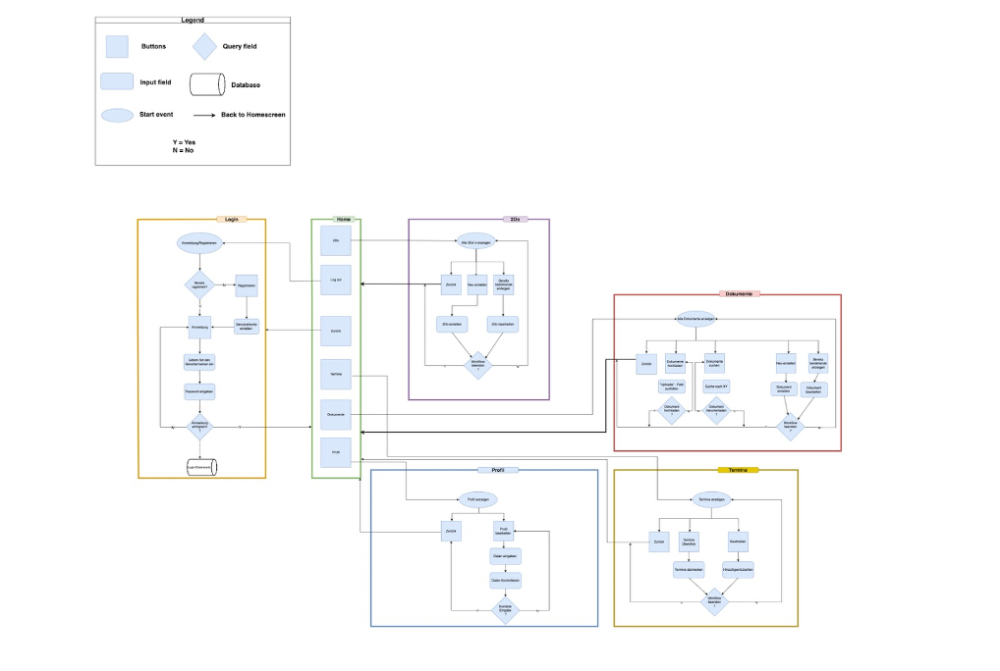

### Aybüke Yigit 
### Funda Aydemir 

# Data model

Das Datenmodell von "2DO" umfasst nur eine Hauptentität:

**Aufgaben**: Die Aufgabenentität repräsentiert die einzelnen Aufgaben, die von den Benutzern erstellt werden. Jede Aufgabe hat einen Namen und einen Status, der angibt, ob sie abgeschlossen ist oder nicht.
Referenz:
Die wichtigsten Funktionen und Methoden in "2DO" sind:

**Neue Aufgabe hinzufügen**: Die Funktion todo() in der Route "/2DO" ermöglicht es Benutzern, eine neue Aufgabe hinzuzufügen, indem sie das Formular ausfüllen und absenden.

**Aufgabe löschen**: Die Funktion delete_task(index) in der Route "/delete_task/int:index" erlaubt Benutzern, eine Aufgabe aus der Liste zu löschen, indem sie den entsprechenden "Löschen"-Button neben der Aufgabe anklicken.

**Aufgabenliste anzeigen**: Die Aufgabenliste wird dynamisch auf der "2DO"-Seite aktualisiert, um die aktuellen Aufgaben und ihren Status anzuzeigen.
