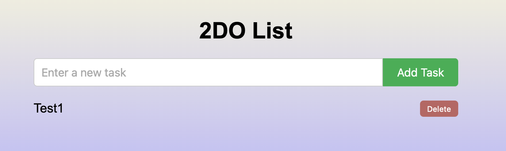
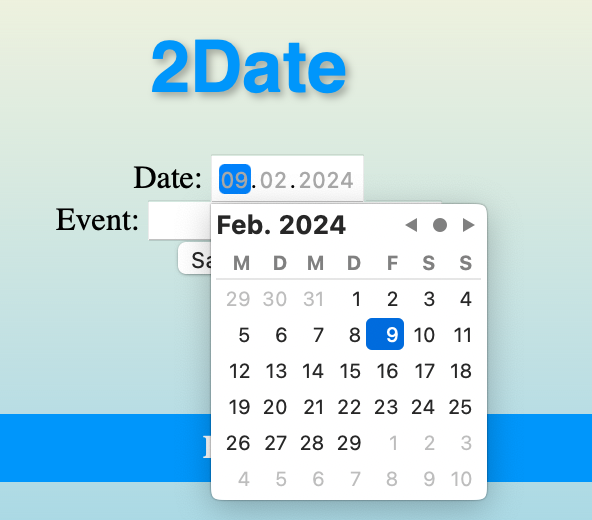
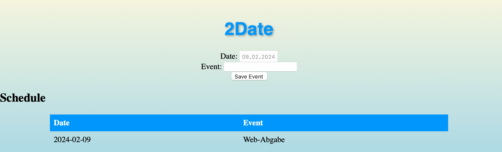
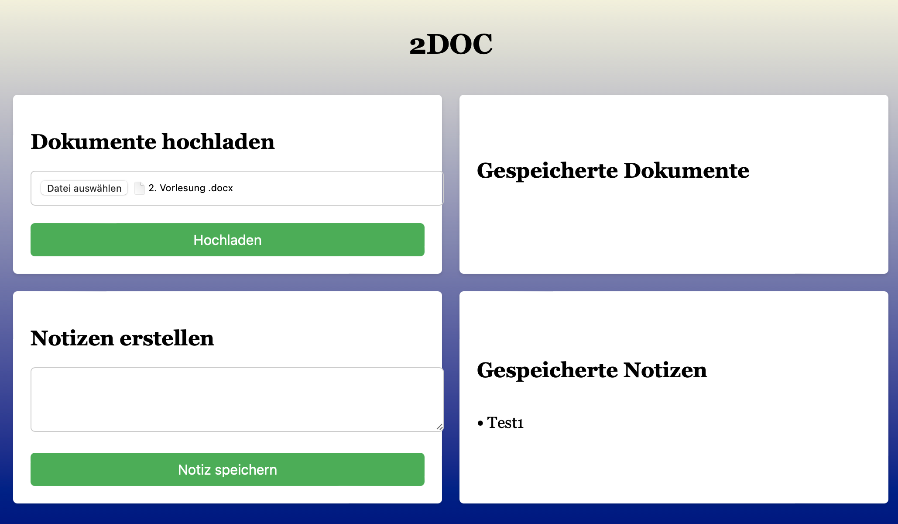

# Reference documentation
{: .no_toc }

{: .text-delta }

Table of contents

+ ToC
{: toc }

## Funktionen zur Verwaltung von Aufgaben (To-Do-Listen)

### `function_definition()`

**Route:** `/2DO/`

**Methods:** `/POST GET/`

**Purpose:** Ermöglicht Benutzern das Hinzufügen und Anzeigen von Aufgaben in ihrer To-Do-Liste.

**Route:** /delete_task/int:index

**Methods:** ` /GET/`

**Purpose:** Löscht eine Aufgabe aus der To-Do-Liste anhand ihres Index.

**Sample output:**

---

## Funktionen zur Verwaltung von Ereignissen (Kalender)

**Route:** ` /2DATE/`

**Methods:** `POST GET`

**Purpose:** Ermöglicht Benutzern das Hinzufügen und Anzeigen von Ereignissen in ihrem Kalender.

**Route:**  /view_document/<filename>

**Methods:** GET

**Purpose:** Zeigt das hochgeladene Dokument mit dem angegebenen Dateinamen an.

**Sample output:**

---

### Funktionen zur Verwaltung von Dokumenten und Notizen

**Route:** `/2DOC/` 

**Methods:** POST GET

**Purpose:** Ermöglicht Benutzern das Hochladen von Dokumenten und das Hinzufügen von Notizen.

**Route:** /view_document/<filename>

**Methods:** GET

**Purpose:** Zeigt das hochgeladene Dokument mit dem angegebenen Dateinamen an.

**Sample output:**

---

